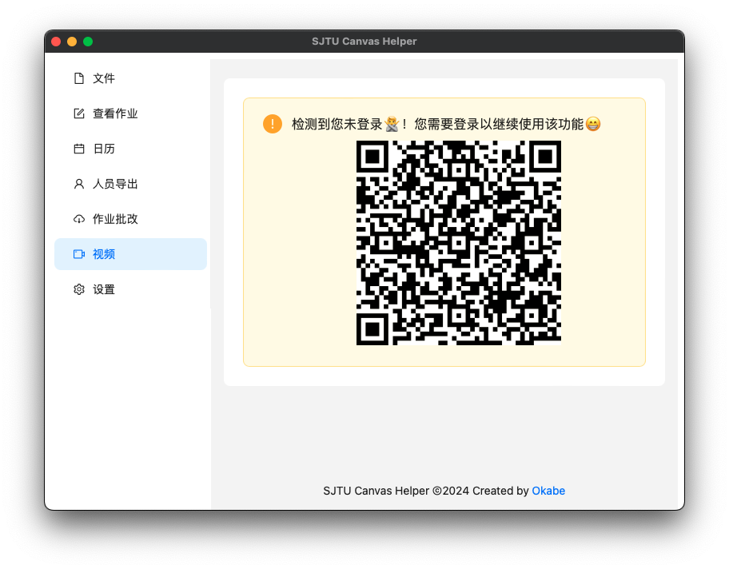
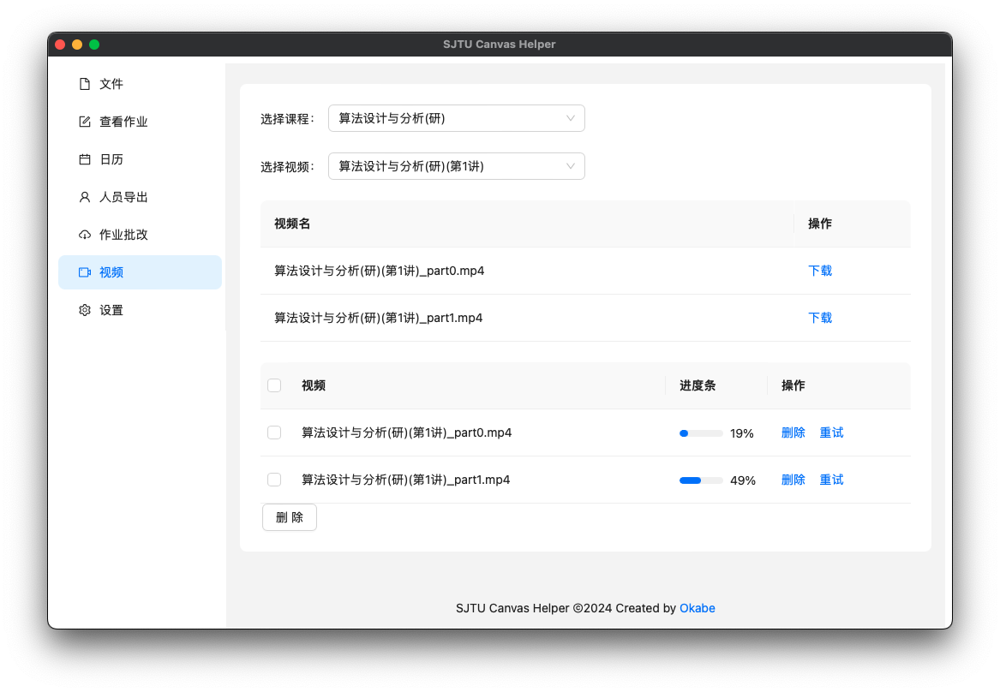
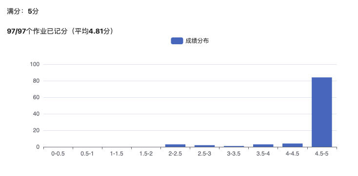
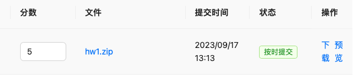
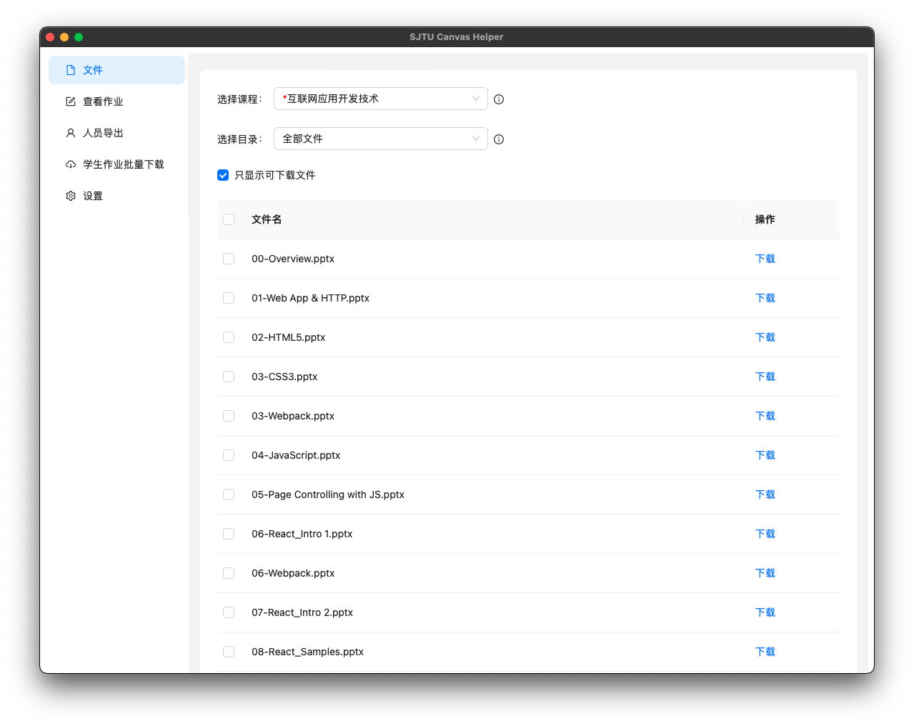
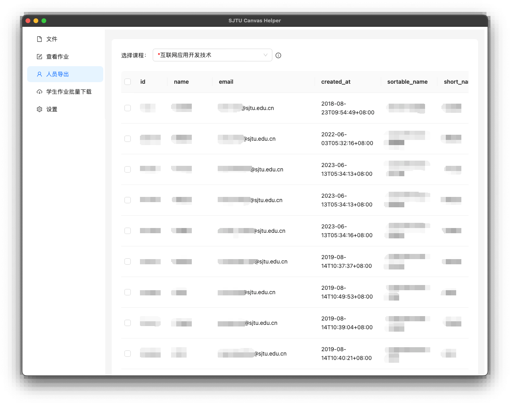

# SJTU Canvas Helper

SJTU Canvas 小帮手，基于 [Tauri](https://tauri.app/) 开发。

  
   
   
  

## Main Features
+ [x] 文件下载
+ [x] 人员名单导出
+ [x] 查看作业
+ [x] 学生提交作业批量下载
+ [x] 视频下载

### 预览

类似 macOS quick look，按下空格打开预览，再次按下空格关闭预览。

https://github.com/Okabe-Rintarou-0/SJTU-Canvas-Helper/assets/58595459/7f05cabc-7bf9-4f58-91ea-f3efed151733

**支持预览主流压缩文件（7z, zip, rar...）**

## 下载课程录屏

## 查看作业评分分布
  

  
## 作业评分
  
输入合法的分数，然后按下回车；如果想撤回分数，则清空输入框，再次按下回车。

## 下载课程文件
  

  
## 查看作业
  

## 导出课程人员名单
  

  
## 学生提交作业批量下载

