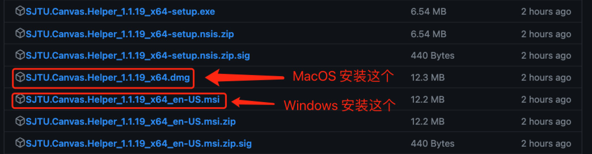
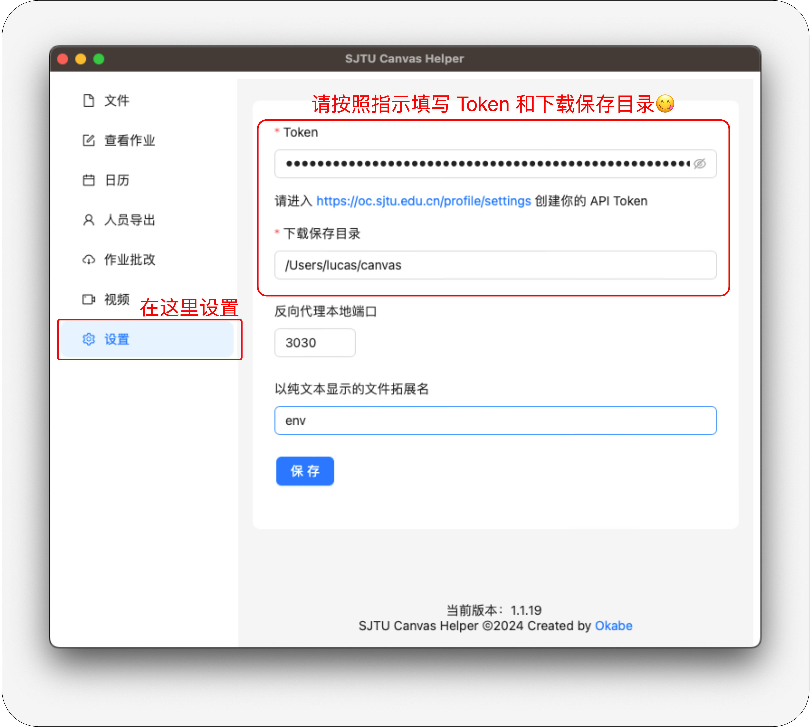
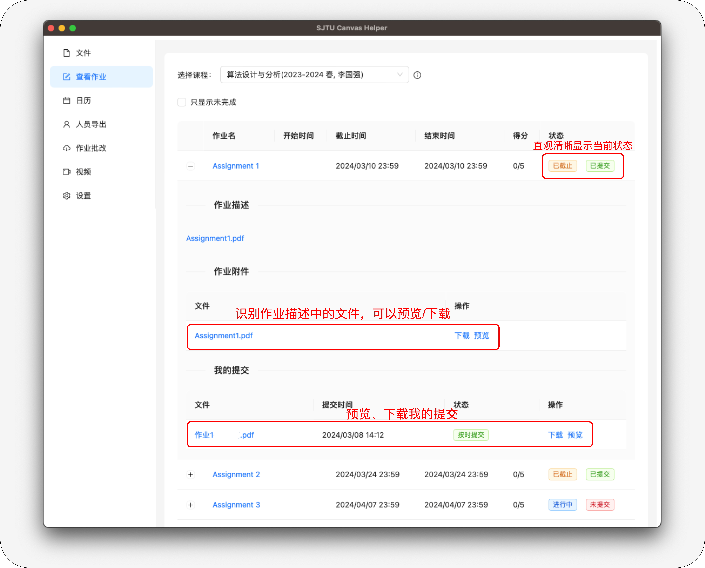
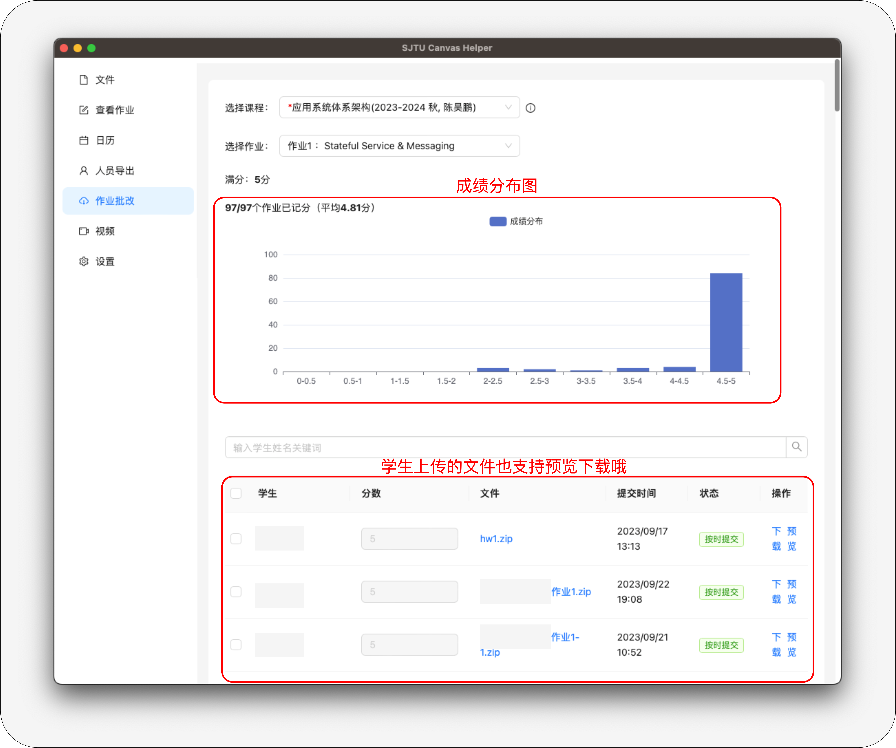
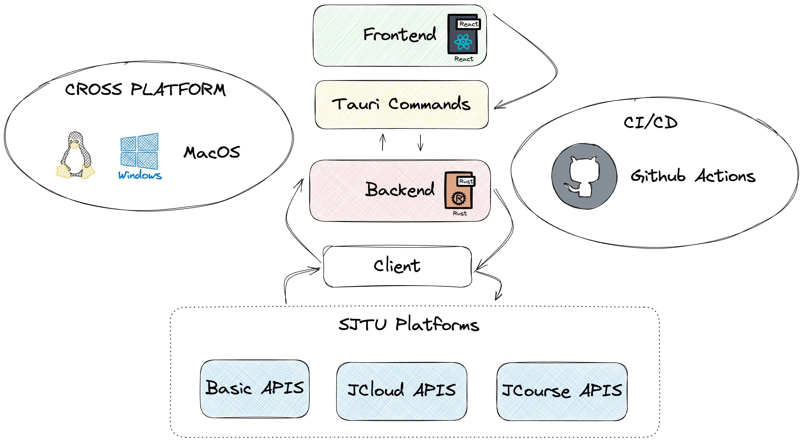

# SJTU Canvas Helper


**还在为下载一堆学生上传的压缩包而苦恼吗？**

SJTU Canvas 小帮手，帮助您更便捷地使用交大 Canvas。基于 [Tauri](https://tauri.app/) 开发。
参与讨论：[水源社区](https://shuiyuan.sjtu.edu.cn/t/topic/245275)。

<div align="center">
  
   
   
  
</div>

## 安装指南

您只需要前往 [Release](https://github.com/Okabe-Rintarou-0/SJTU-Canvas-Helper/releases) 正确安装一次即可，后续如果主版本更新，您可以自动拉取更新，无需重复下载安装。

如果您使用的是 Windows 系统，建议下载 `.msi` 安装包，以支持自动更新功能。



您还可以使用免安装便携版：SJTU.Canvas.Helper_v_x.x.x_x64_portable.zip(Windows 用户)。

在您安装完毕后，请前往设置页面填写您的 `Canvas Token` 以及您的文件下载保存目录。



MacOS 遇到打不开的问题，请看：[在 Mac 上安全地打开 App](https://support.apple.com/zh-cn/102445)。如果显示已损坏，请尝试执行以下命令：
```shell
cd /Applications 
sudo xattr -r -d com.apple.quarantine /Applications/SJTU\ Canvas\ Helper.app SJTU\ Canvas\ Helper.app
```

### Arch Linux 安装方式  
通过 [yay](https://github.com/Jguer/yay) 从 AUR 安装：  
```bash  
yay -S sjtu-canvas-helper
```

## 致谢

感谢以下用户为本仓库做出的贡献：

<!-- ALL-CONTRIBUTORS-LIST:START - Do not remove or modify this section -->
<!-- prettier-ignore-start -->
<!-- markdownlint-disable -->
<table>
  <tbody>
    <tr>
      <td align="center" valign="top" width="14.28%"><a href="https://github.com/pangbo13"><br /><sub><b>PangBo</b></sub></a><br /><a href="https://github.com/Okabe-Rintarou-0/SJTU-Canvas-Helper/commits?author=pangbo13" title="Code">💻</a></td>
    </tr>
  </tbody>
</table>

<!-- markdownlint-restore -->
<!-- prettier-ignore-end -->

<!-- ALL-CONTRIBUTORS-LIST:END -->

## Main Features
+ [x] 文件下载 / 预览(免下载) / PDF & PPTX 混合合并(免下载)
+ [x] 一键上传[交大云盘（新）](https://pan.sjtu.edu.cn/)
+ [x] DDL 日历 
+ [x] 人员名单导出
+ [x] 查看/提交作业
+ [x] 批改作业/修改作业 DDL
+ [x] 支持密院和本部 canvas 系统
+ [x] ~~视频下载/播放~~ (由于视频网站变动，该功能暂不支持)
+ [x] 自动更新 

### 文件下载/预览

类似 macOS quick look，按下空格打开预览，再次按下空格关闭预览。

https://github.com/Okabe-Rintarou-0/SJTU-Canvas-Helper/assets/58595459/7f05cabc-7bf9-4f58-91ea-f3efed151733

**支持预览主流压缩文件（7z, zip, rar...）**


### 文件一键上传交大云盘


### 课程录屏播放/下载


### 查看课程作业



### 学生提交作业查看/批改/修改 DDL
  
输入合法的分数，然后按下回车；如果想撤回分数，则清空输入框，再次按下回车。



## 开发指南



+ 下载 [Rust](https://www.rust-lang.org/tools/install)。Rust 快速学习：[Rust语言圣经(Rust Course)](https://course.rs/about-book.html)。
+ 下载 [NodeJS](https://nodejs.org/en/download/current)，自带 `npm` 和 `yarn` 包管理器。
+ 启动项目：
  ```shell
  yarn tauri dev
  ```
+ Tauri 基于 WebView ，所以你可以把它当成一个浏览器来 debug。MacOS 可以按下 `⌘command + ⌥option + i` 查看控制台；Windows 则为 `ctrl + shift + i `。

## Star History

[](https://star-history.com/#Okabe-Rintarou-0/SJTU-Canvas-Helper&Date)
