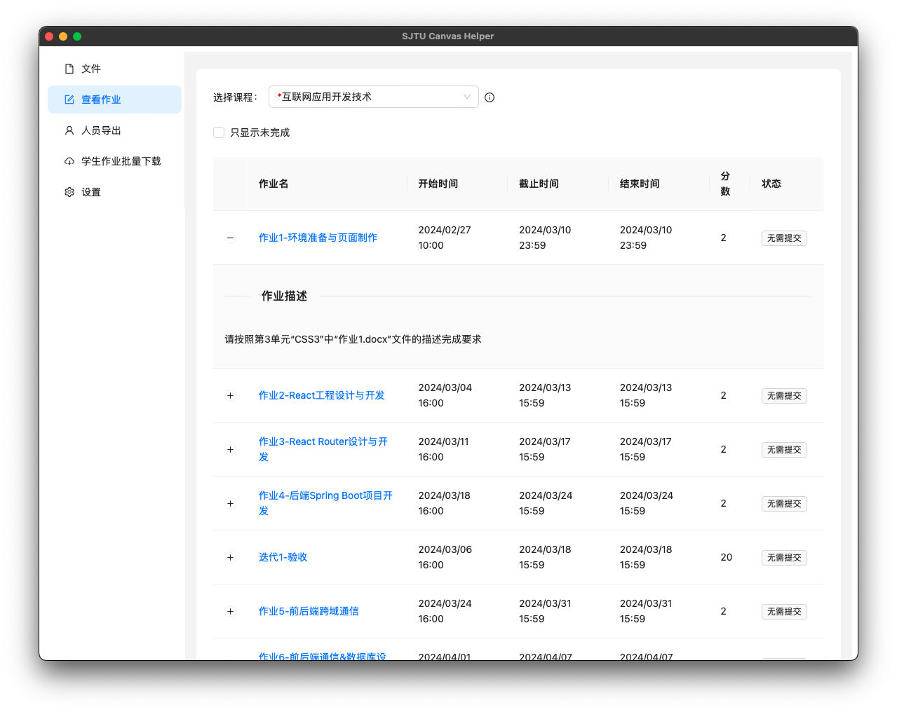

# SJTU Canvas Helper

SJTU Canvas 小帮手，基于 [Tauri](https://tauri.app/) 开发。

  
   
   
  

## Main Features
+ 下载课程文件

+ 查看作业

+ 导出课程人员名单

+ 学生提交作业批量下载

# TODO List

+ [x] 文件下载
+ [x] 人员名单导出
+ [x] 查看作业
+ [x] 学生提交作业批量下载
+ [ ] 视频下载
