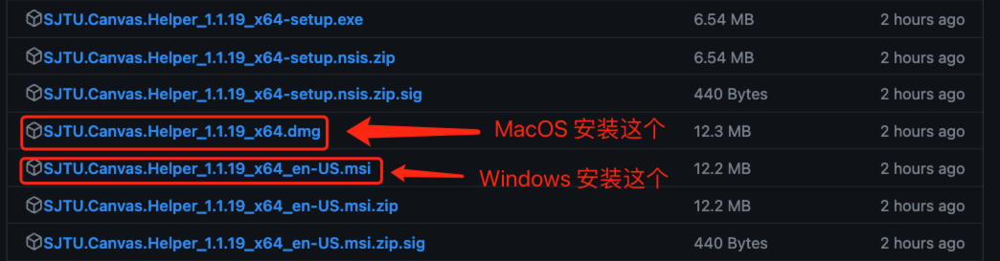
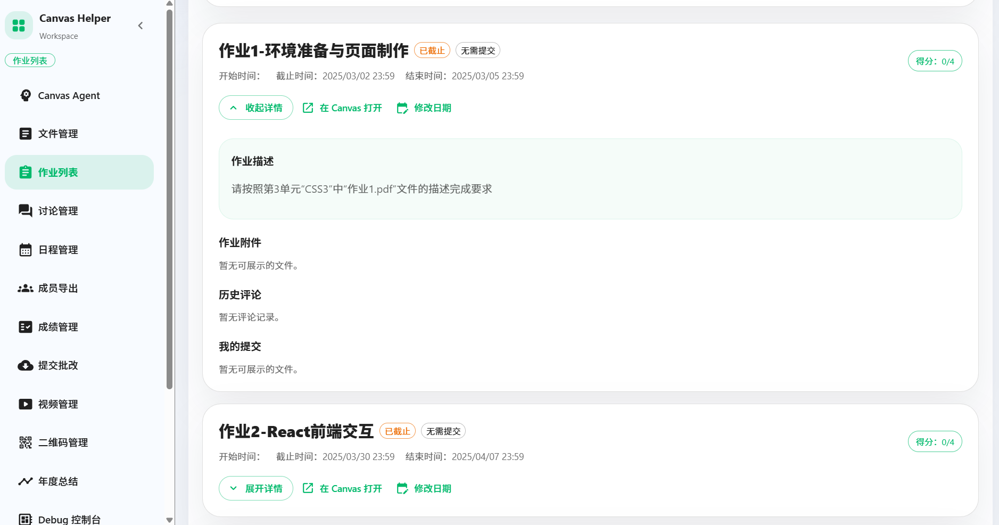
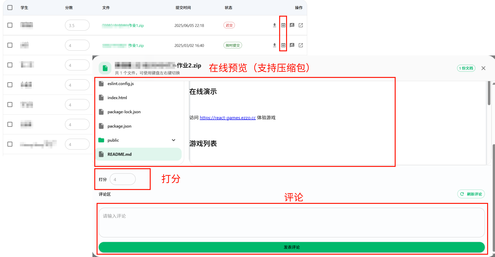
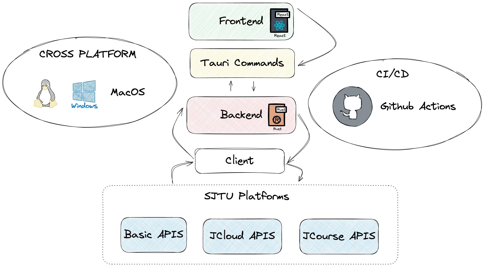

# SJTU Canvas Helper


**还在为下载学生上传的大量压缩包而苦恼吗？**

SJTU Canvas 小帮手提供桌面版（基于 [Tauri](https://tauri.app/)）和 Android 版本，助您更便捷地使用交大 Canvas。

**📱 Android 版本**: 采用 Material You 设计，支持手机和平板。查看 [Android README](./android/README.md) 了解详情。

参与讨论：[水源社区](https://shuiyuan.sjtu.edu.cn/t/topic/245275)。

<div align="center">
  
   
   
  
</div>

## 安装指南



### 基础安装

1. 前往 [Release](https://github.com/Okabe-Rintarou-0/SJTU-Canvas-Helper/releases) 页面下载并安装一次即可，后续主版本更新将自动拉取，无需重复下载

2. **Windows 系统**：
   - 推荐下载 `.msi` 安装包，支持自动更新功能
   - 也可选择免安装便携版：`SJTU.Canvas.Helper_v_x.x.x_x64_portable.zip`

3. **MacOS 系统**：
   - 下载对应版本安装包
   - 若遇到打不开的问题，可参考 [在 Mac 上安全地打开 App](https://support.apple.com/zh-cn/102445)
   - 若显示已损坏，尝试执行以下命令：
     ```shell
     cd /Applications 
     sudo xattr -r -d com.apple.quarantine /Applications/SJTU\ Canvas\ Helper.app
     ```

4. **Arch Linux 系统**：
   通过 [yay](https://github.com/Jguer/yay) 从 AUR 安装：
   ```bash
   yay -S sjtu-canvas-helper
   ```

5. **Android 系统**：
   - 查看 [Android 版本文档](./android/README.md)
   - 下载 APK 或从应用商店安装（即将推出）

### 首次配置

安装完成后，请前往设置页面填写您的 `Canvas Token` 以及文件下载保存目录。


## 致谢

感谢以下用户为本仓库做出的贡献：

<!-- ALL-CONTRIBUTORS-LIST:START - Do not remove or modify this section -->
<!-- prettier-ignore-start -->
<!-- markdownlint-disable -->
<table>
  <tbody>
    <tr>
      <td align="center" valign="top" width="14.28%"><a href="https://github.com/xeonliu"><br /><sub><b>xeonliu</b></sub></a><br /><a href="https://github.com/Okabe-Rintarou-0/SJTU-Canvas-Helper/commits?author=xeonliu" title="Code">💻</a></td>
      <td align="center" valign="top" width="14.28%"><a href="https://github.com/creeper12356"><br /><sub><b>creeper12356</b></sub></a><br /><a href="https://github.com/Okabe-Rintarou-0/SJTU-Canvas-Helper/commits?author=creeper12356" title="Code">💻</a></td>
      <td align="center" valign="top" width="14.28%"><a href="https://github.com/pangbo13"><br /><sub><b>PangBo</b></sub></a><br /><a href="https://github.com/Okabe-Rintarou-0/SJTU-Canvas-Helper/commits?author=pangbo13" title="Code">💻</a></td>
      <td align="center" valign="top" width="14.28%"><a href="https://github.com/wytili"><br /><sub><b>Yiting Wang</b></sub></a><br /><a href="https://github.com/Okabe-Rintarou-0/SJTU-Canvas-Helper/commits?author=wytili" title="Code">💻</a></td>
      <td align="center" valign="top" width="14.28%"><a href="http://blog.a-stable.com"><br /><sub><b>Yuxuan Sun</b></sub></a><br /><a href="https://github.com/Okabe-Rintarou-0/SJTU-Canvas-Helper/commits?author=definfo" title="Code">💻</a></td>
      <td align="center" valign="top" width="14.28%"><a href="https://github.com/yingyx"><br /><sub><b>Yuxuan Ying</b></sub></a><br /><a href="https://github.com/Okabe-Rintarou-0/SJTU-Canvas-Helper/commits?author=yingyx" title="Code">💻</a></td>
      <td align="center" valign="top" width="14.28%"><a href="https://young-lord.github.io"><br /><sub><b>LY</b></sub></a><br /><a href="https://github.com/Okabe-Rintarou-0/SJTU-Canvas-Helper/commits?author=young-lord" title="Code">💻</a></td>
    </tr>
  </tbody>
</table>

<!-- markdownlint-restore -->
<!-- prettier-ignore-end -->

<!-- ALL-CONTRIBUTORS-LIST:END -->

## Main Features
+ [x] 文件下载 / 预览(免下载) / PDF & PPTX 混合合并(免下载)
+ [x] 一键上传[交大云盘（新）](https://pan.sjtu.edu.cn/)
+ [x] DDL 日历 
+ [x] 人员名单导出
+ [x] 查看/提交作业
+ [x] 批改作业/修改作业 DDL
+ [x] 支持密院和本部 canvas 系统
+ [x] 视频下载/播放/字幕下载/截图抓取合成PDF
+ [x] 自动更新 

### 文件下载/预览

采用类似 macOS Quick Look 的预览体验：
- 按下空格打开预览
- 再次按下空格关闭预览

https://github.com/Okabe-Rintarou-0/SJTU-Canvas-Helper/assets/58595459/7f05cabc-7bf9-4f58-91ea-f3efed151733

**支持预览主流压缩文件（7z, zip, rar...）**


#### 支持的文件预览格式

| 文件类型 | 格式                                                 | 支持状态 |
| -------- | ---------------------------------------------------- | -------- |
| 文档     | PDF                                                  | ✅        |
| 文档     | DOCX                                                 | ✅        |
| 文档     | Markdown                                             | ✅        |
| 表格     | XLSX                                                 | ✅        |
| 代码     | 多种编程语言代码（见说明）                           | ✅        |
| 图片     | PNG, JPG, JPEG, BMP, GIF, TIFF, SVG, ICO, WEBP, AVIF | ✅        |
| 笔记本   | IPYNB (Jupyter Notebook)                             | ✅        |
| 压缩包   | ZIP, RAR, 7Z 等主流格式                              | ✅        |

**代码文件支持说明：** 支持多种编程语言代码预览，包括但不限于：C/C++, Java, Python, JavaScript, TypeScript, Go, Rust, PHP, Ruby, Swift, Kotlin 等。详细支持列表请参考 [highlight.js 支持的语言](https://github.com/highlightjs/highlight.js/blob/main/SUPPORTED_LANGUAGES.md)。

### 文件一键上传交大云盘


### 课程录屏播放/下载


### 查看课程作业



### 学生提交作业查看/批改/修改 DDL
  
输入合法的分数，然后按下回车；如果想撤回分数，则清空输入框，再次按下回车。



## 开发指南



配合 AI 理解项目框架：https://deepwiki.com/Okabe-Rintarou-0/SJTU-Canvas-Helper

### 开发环境搭建

1. 安装 [Rust](https://www.rust-lang.org/tools/install) 开发环境
   - Rust 快速学习资源：[Rust语言圣经(Rust Course)](https://course.rs/about-book.html)

2. 安装 [NodeJS](https://nodejs.org/en/download/current)
   - 安装后将自动包含 `npm` 和 `yarn` 包管理器

### 启动项目

```shell
yarn tauri dev

# 如果支持 make
make dev
```

### 调试说明

Tauri 基于 WebView 构建，可按以下方式打开开发者工具：
- **MacOS**: 按下 `⌘ + ⌥ + i` 打开控制台
- **Windows**: 按下 `Ctrl + Shift + i` 打开控制台

## Star History

[](https://star-history.com/#Okabe-Rintarou-0/SJTU-Canvas-Helper&Date)
